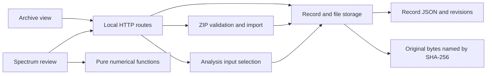

# Implementation tour and local walkthrough

The workbench has two browser views sharing one record store. The archive manages
materials and metadata; spectrum review reads selected inputs and saves processing
state. Both use the same revision number to prevent one view overwriting a newer save.



## Where to start reading

| Concern | Code | Check |
| --- | --- | --- |
| Atomic saves, shared originals, trash | `scripts/archive_store.py` | `tests/test_archive.py` |
| Routes, limits, origin checks, lock | `scripts/serve_prototype.py` | `tests/test_server.py` |
| Untrusted ZIPs and independent copies | `scripts/archive_transfer.py` | `tests/test_archive_transfer.py` |
| Input dependencies and invalidation | `scripts/review_inputs.py` | `tests/test_review_inputs.py` |
| Search and date semantics | `prototype/archive-filters.mjs` | `tests/archive-filters.test.mjs` |
| Coordinate transforms and integration | `prototype/core.mjs` | `tests/core.test.mjs` |

An upload writes or verifies immutable bytes before atomically replacing the record
JSON. A failed record write can leave an unreferenced file, but it must not leave a
record pointing to missing new bytes. This is tested by injecting a write failure.
It is not a multi-process transaction system; use one server for each record directory.

Trash changes metadata and preserves bytes. A file can be shared by several records,
so moving one attachment to trash must not delete the underlying blob. The
[retention decision](decisions/001-record-lifecycle.md) explains the maintainer's choice.

ZIP import first checks paths, sizes, manifest identities, hashes and review structure.
Only then does it write files and publish a new record. Member names are never used as
filesystem extraction paths. Import verifies storage integrity, not scientific results.

Changing an analysis input clears results that depend on it. CSV changes reset columns,
units, comparison and calculations; image changes also reset calibration and extracted
points. Metadata edits do not invalidate analysis. These are separate operations rather
than one generic record-update function so their different effects remain explicit.

## Reproduce a complete workflow

Start an isolated instance so practice records do not mix with working experiments:

```powershell
python scripts/serve_prototype.py --port 8766 --records-dir data/walkthrough-records
```

1. Open `http://127.0.0.1:8766/archive`, create a record and leave the experiment date
   blank. Save it, then attach `examples/triangle.csv` and a text note of your choice.
2. Search for `triangle`, select **Tables**, and enable **Unknown experiment dates only**.
   The record should remain visible. **Images** should hide it. Clear the filters.
3. Preview the CSV and choose **Use as CSV input**. Confirm the change and open spectrum
   review. Select columns `x` and `y`, set the interval to `0`–`2`, and calculate.
   Expected results: 3 samples, maximum 2 at x=1, area 2. The area follows directly
   from a triangle with base 2 and height 2; it is not an instrument-accuracy claim.
4. Save the review. Return through **Archive** and edit its notes. Reopen spectrum
   review: the calculated result should remain. The CSV's trash control is disabled
   while it is an active input.
5. Export the record ZIP and import it. A new record should appear, with the original
   still present. The imported copy should reopen with the same inputs and result.
6. On the copy, detach the CSV from analysis. Its old calculation should be cleared,
   but the original CSV should still be downloadable. Move the file to trash, restore
   it, then move the whole copy to trash and restore it. No bytes are permanently removed.
7. Open the same record in two windows. Save a metadata edit in one, then try saving
   from the other. The stale save should be rejected. Refresh before editing again.

## Reviewing a change

Work on a focused branch, include the behavior change and its meaningful tests in
the same commit, and update affected documentation. Push completed increments so
the Linux and Windows CI results accompany the history. Integrate after reviewing
the diff and checking CI. Do not backdate work or manufacture review approvals.

For implementation review, trace an upload through its file write and record write;
explain what survives a failure between them. Then trace a stale save and an input
replacement. These are concrete places to discuss integrity, concurrency and dependency
handling. A green test suite alone does not establish personal understanding.

Agent walkthrough results and outstanding maintainer review are listed in
[Development status](status.md). Only record a personal review or acceptance after
it has actually happened.
